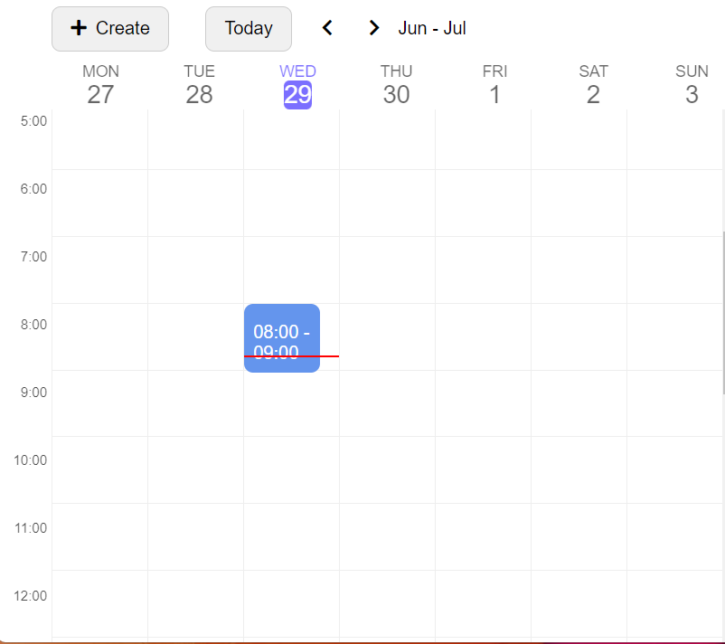

<h1><a href='https://dynamic-cheesecake-0241be.netlify.app/'>calendar-react-project</a></h1>

<lu style="font-size:20px" ><b>The tech stack is:</b>

<li ><a href="https://nodejs.org/en/" target="blank">Node</a></li>
<li ><a href="https://www.npmjs.com/" target="blank">Npm</a></li>
<li ><a href="https://git-scm.com/" target="blank">Git</a></li>
<li ><a href="https://reactjs.org/" target="blank">React</a></li>
<li ><a href="https://en.wikipedia.org/wiki/HTML5" target="blank">HTML5</a></li>
<li ><a href="https://www.npmjs.com/package/eslint" target="blank">Eslint</a></li>
<li ><a href="https://babeljs.io/" target="blank">Babel</a></li>
<li ><a href="https://webpack.js.org/" target="blank">Webpack</a></li>
<li ><a href="https://sass-lang.com/" target="blank">Sass(Scss)</a></li>
<li ><a href="https://en.bem.info/methodology/" target="blank">BEM methodology</a></li> 

</lu>

<ol>
<h2>Getting Started</h2>
<li>Make sure you have git, node, and npm installed.</li>
<li>Execute npm install from the root directory of the repository to install the dependencies.</li>
<li>Execute npm start for development mode (npm run build for a production build)</li>
</ol>

<ol><h2>Development</h2>
<li>Install the node dependencies <b>npm install</b></li>
<li>Start the environment with <b>npm start</b></li>
<li>Visit your new local environment at <b><a href="http://localhost:8080/"  target="blank">http://localhost:8080/</a></b></li>
</ol>

<lu  style="font-size:20px" padding-top="10px" ><b>Author</b></lu>

<li>Starkova Valentyna</li>
